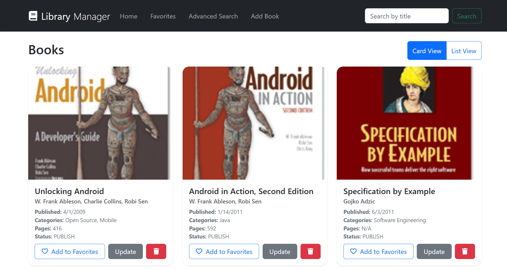
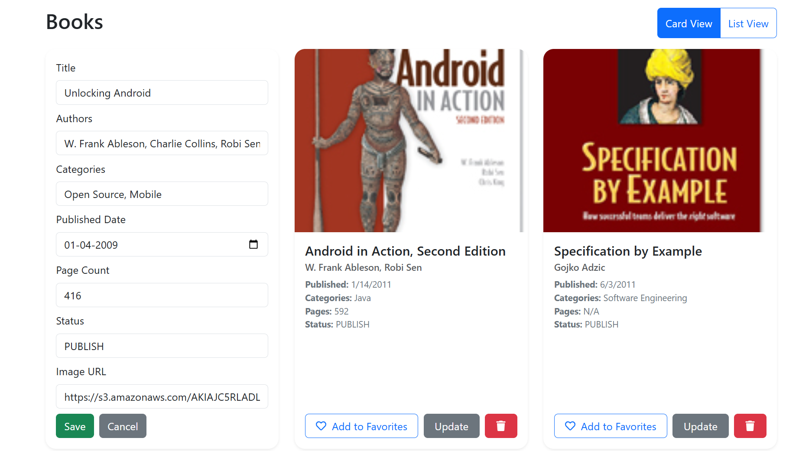
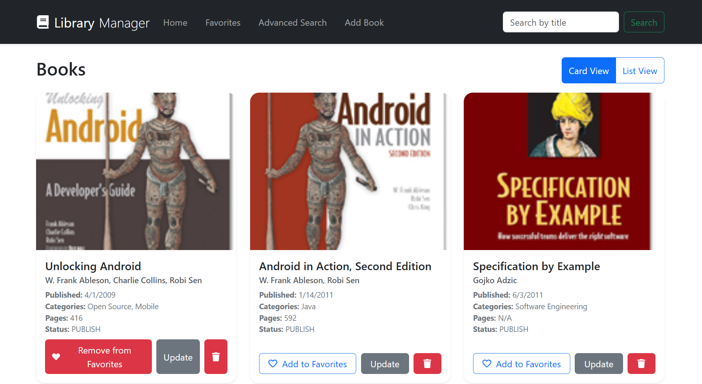
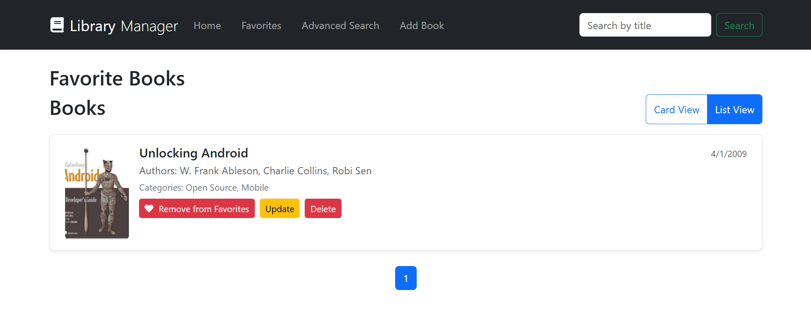
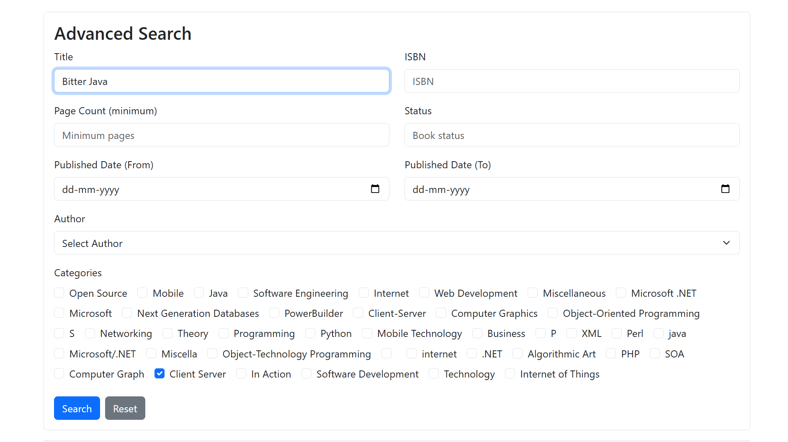
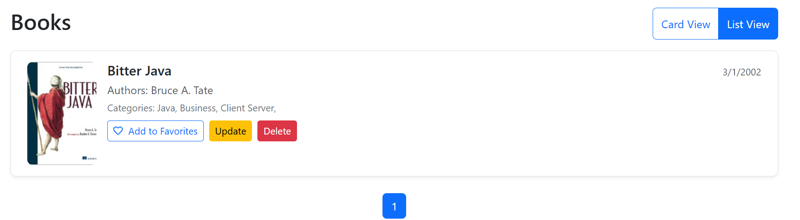
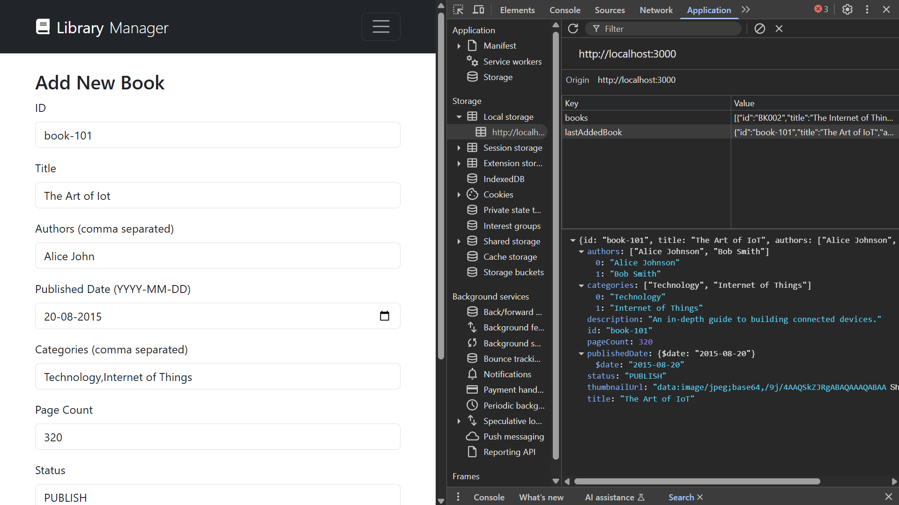

# Library Manager App


An elegant and efficient Library Manager App built with modern web technologies. Manage your book collection effortlessly with features like advanced search, favorites, and easy book addition. Designed for simplicity and performance, this app helps you keep your library organized and accessible.

## 🚀 Technologies Used

- **React 19.x** - A powerful JavaScript library for building user interfaces.
- **Redux Toolkit** - Simplifies Redux state management.
- **React Redux** - Official React bindings for Redux.
- **React Router DOM** - Declarative routing for React apps.
- **React Bootstrap** - Bootstrap components built with React.
- **React Hook Form** - Performant, flexible, and extensible forms with easy-to-use validation.
- **React Icons** - Popular icons as React components.
- **Testing Libraries** - @testing-library/react, jest-dom, user-event for robust testing.

## Prerequisites

- Node.js (version 14 or higher recommended)
- npm (comes with Node.js)

## Installation

1. Clone the repository or download the source code.
2. Navigate to the project directory in your terminal.
3. Run the following command to install dependencies:

```bash
npm install
```

## Running the App

Start the development server with:

```bash
npm start
```

Open [http://localhost:3000](http://localhost:3000) in your browser to explore the app. The page reloads automatically on code changes.

## Building the App

Create a production-ready build with:

```bash
npm run build
```

The optimized files will be in the `build` folder, ready for deployment.

## Testing

Run tests interactively with:

```bash
npm test
```

## Project Structure

- `src/components/` - Reusable UI components like `AdvancedSearch`, `BookCard`, `BookList`, `Navbar`, and `SearchBar`.
- `src/pages/` - Page components including `AddBook`, `AdvancedSearchPage`, `Favorites`, and `Home`.
- `src/redux/` - Redux slices and store configuration.
- `src/data/` - Static data files such as `books.json`.
- `src/App.js` - Main application component.
- `src/index.js` - React app entry point.

## Features

- Advanced book search with multiple filters.
- Add new books to your collection easily.
- Manage and view your favorite books.
- Responsive design with React Bootstrap.
- Efficient state management using Redux Toolkit.
- Smooth client-side routing with React Router.


## Screenshots

### Book List View



### Book Update Form




### Add to Favorite Page



### Favorites Page




### Advanced Search Page





### Local Storage



## Useful Links

- [React Documentation](https://reactjs.org/)
- [Redux Toolkit Documentation](https://redux-toolkit.js.org/)
- [React Router Documentation](https://reactrouter.com/)
- [React Bootstrap Documentation](https://react-bootstrap.github.io/)


